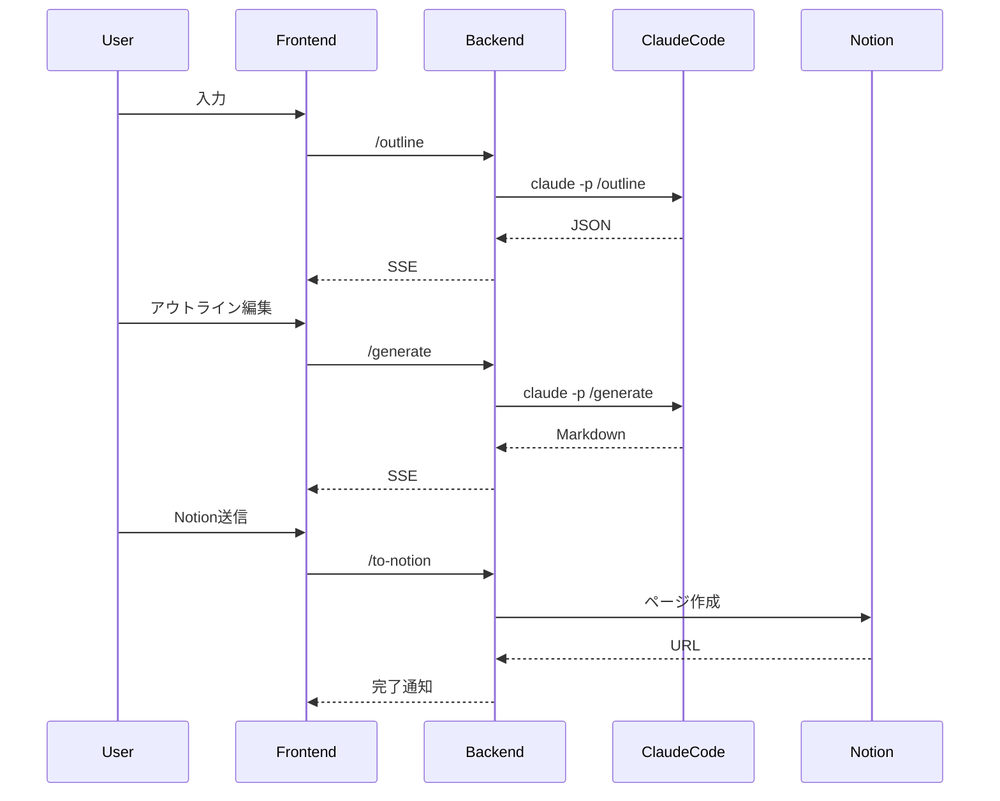

# Notion記事自動生成システム 仕様書（最終更新版）

---

## 1. 概要

目的: URLおよびローカルファイル（.md, .txt）とユーザー入力をもとに、Claude Codeで記事を生成し、Notion APIで固定データベースにページを自動作成するローカルWebアプリを提供する。
想定利用: 個人のローカル実行（認証なし）。
スタイル: 日本語専用。

---

## 2. ユーザーフロー

1. 入力
2. 抽出・統合（内部処理）
3. アウトライン生成（SSE）→ 編集（H2/H3, D&D, インライン）
4. 本文生成（SSE, Markdown）→ 再生成（全文/セクション/段落）または手動修正
5. Notion送信（固定DB, プロパティ設定）／Markdownダウンロード

備考: 各ステップで自動リトライ（指数バックオフ）、失敗時のみ通知し該当ステップから再開。

---

## 3. 入力と設定

- **必須UI**
  - 入力フォーム: タイトル、カテゴリ、キーワード、スタイルテンプレ（A/B/C）、記事の方針、URL複数、ファイル複数（.md/.txt）、追加メモ
  - アウトラインエディタ: H2/H3、D&D並び替え、インライン編集、セクション所要文字数メモ
  - 本文エディタ: Markdown編集＋プレビュー、再生成ボタン
  - Notion送信ダイアログ: タイトル改善案の選択、カテゴリ/キーワード最終確認、送信
  - トースト/進行表示: 実行中・成功・失敗表示、詳細展開

- **カテゴリ/キーワード**
  - Notionの既存候補から選択＋自由入力で新規追加可
  - 入力補完あり

- **スタイルテンプレ**
  - A: 技術ブログ風
  - B: 解説記事風
  - C: ノート風

- **記事の方針**
  - 入力方式: 自由記述、プリセット項目フォーム
  - 反映点: トーン/文体、構成制約、長さ制御

---

## 4. 抽出・前処理

- URL取得: 静的取得
- 本文抽出: Trafilatura → 失敗時は BeautifulSoup
- ポリシー: ノイズ最小化重視
- 出力: 軽量Markdownに正規化

---

## 5. Claude Code利用

- **実装方針**
  - `.claude/commands/` にコマンドを定義
  - バックエンドは `claude -p <command> <args>` 実行
  - 出力は成果物のみ（説明禁止）

- **主要コマンド**
  - `/outline`: アウトラインJSON生成
  - `/generate`: 本文Markdown生成
  - `/regenerate`: 全文/部分Markdown再生成
  - `/repair`: JSON/Markdown修復

- **入出力契約**
  - `/outline`: `{"outlineVersion":"1.0","nodes":[...]}`
  - `/generate`/`/regenerate`: H2/H3＋`<!-- id: ... -->`必須
  - `/repair`: 修正済み成果物のみ

- **SSE**
  - `progress` / `partial` / `complete` / `error`

---

## 6. サイズ超過時の処理

- アウトライン: 全体要約参照
- 本文: チャンク単位生成 → 統合

---

## 7. 応答検証と変換

- アウトライン: JSONスキーマ検証、失敗時は`/repair`
- 本文: Markdown検証、失敗時は`/repair`
- 再試行: 1回修復 → 失敗で通知

---

## 8. Notion連携

- 作成先: 固定DB（NOTION_DATABASE_ID）
- プロパティ: Name（タイトル）、Category（Select）、Keywords（Multi-select）
- ページタイトル: Claude提案案から選択可能
- ブロック: heading_2, heading_3, 段落、リスト、コード、引用、表、画像
- 送信失敗時: 自動リトライ → 詳細表示 → 再送ボタン
- Notion側に存在しないカテゴリ/キーワードは自動作成
- 送信前にNotion形式プレビューを表示

---

## 9. エクスポート

- 手動ダウンロード: Markdown
- ファイル名: `YYYYMMDD-title-slug.md`
- UTF-8（BOMなし）、先頭に任意のメタコメント

---

## 10. バックエンドAPI

- `/extract`: 抽出
- `/outline`: アウトライン生成（SSE）
- `/generate`: 本文生成（SSE）
- `/regenerate`: 再生成（SSE）
- `/to-notion`: ページ作成

---

## 11. フロントエンド

- 単一ページウィザード
- `/outline`, `/generate`, `/regenerate`: SSE通信
- その他: HTTP/JSON

---

## 12. 環境・起動・設定

- `.env`: `NOTION_API_KEY`, `NOTION_DATABASE_ID`, `CLAUDE_BIN`, `REQUEST_TIMEOUT_SEC`
- 開発: Next.js & FastAPI（ホットリロード有効）
- 運用: Docker Compose（frontend, backend, proxy/nginx）
- proxy: SSL/TLS, SSE/CORS

---

## 13. 保存・ログ・メトリクス

- 保存: Markdownダウンロード、Notion送信
- ログ: アクセス＋エラー最小限（サーバログは1MB/5世代でローテーション）
- メトリクス: なし

---

## 14. エラーハンドリング

- 自動リトライ（指数バックオフ 2^n, 最大5回）
- 通知: トースト＋詳細展開
- ステップ再開可能
- `/repair` 自動実行、不正時のみ通知

---

## 15. テスト

- **単体**: pytest（extract, outline, generate, regenerate, repair）
- **E2E**: Playwright（入力→送信まで一連）
- **CI**: GitHub Actions

---

## 16. セキュリティ・制約

- 認証なし（ローカル前提）
- APIキー: `NOTION_API_KEY` のみ
- 通信: ローカルは平文、運用はSSL推奨
- 個人利用・小規模前提

---

## 17. Docker / 運用

- サービス: frontend, backend, proxy
- Compose: dev用（ホットリロード）, prod用（最適化ビルド）
- `.env` を `env_file` で注入
- SSL/TLS: proxyに証明書マウント可能

---

## 18. 技術スタック

- フロント: Next.js, TypeScript, react-markdown
- バックエンド: FastAPI, Python3.11+, subprocessでClaude Code実行
- 外部API: Notion API
- 運用: Docker Compose, Nginx
- テスト: Playwright, pytest

---

## 19. 制約事項

- ローカル実行前提
- 入力サイズ: ファイル最大10MB、合計100MB
- モデルはClaude Codeに依存
- 商用利用・大規模対応は対象外
- 出力品質はClaude Code依存

---

# 運用ガイド

- 開発: Next.js (`npm run dev`), FastAPI (`uvicorn app.main:app --reload`)
- 本番: `docker compose -f docker-compose.yml up -d --build`
- proxy: SSL/TLS, SSE/CORS 調整
- Notion送信確認: APIキー・DB ID設定必須
- 一時ファイル: `/tmp/notion-article-creator/{uuid}/`、原則削除

---

# カスタムコマンド一覧

- `/outline`: アウトラインJSON生成
- `/generate`: 本文Markdown生成
- `/regenerate`: 全文/部分再生成
- `/repair`: JSON/Markdown修復
- 出力は成果物のみ、日本語専用、検証エラー時は `/repair` を自動実行

---

# Notion DB プロパティ仕様

- **Name**（タイトル）
- **Category**（Select）
- **Keywords**（Multi-select）

---

# 補足: 開発・運用設計

## API 共通レスポンス

```json
{
  "status": "success | error",
  "data": {...},
  "error": {...}
}
```

## データフロー図

```mermaid
flowchart TD
    A[入力] --> B[抽出/正規化]
    B --> C[/outline]
    C --> D[アウトラインJSON]
    D --> E[/generate]
    E --> F[本文Markdown]
    F --> G[Notion送信/保存]
    F --> H[/regenerate]
    C --> I[/repair]
    E --> I
```

## シーケンス図



---

# テストケース一覧

- **単体（pytest）**: extract, outline, generate, regenerate, repair
- **E2E（Playwright）**: 入力→送信完走、SSE反映、失敗時のエラー通知

---

# 付録

## エラーコード一覧

| コード | 発生箇所 | 内容 | ハンドリング |
|--------|-----------|------|---------------|
| E100 | extract | 抽出失敗 | 再入力可 |
| E200 | outline | JSON不正 | /repair、自動再試行 |
| E300 | generate | Markdown不正 | /repair |
| E301 | regenerate | ID不一致 | エラー通知 |
| E400 | repair | 修復不能 | 通知 |
| E500 | to-notion | API失敗 | リトライ＋再送 |
| E501 | to-notion | DB不整合 | 自動作成 |
| E900 | system | タイムアウト | リトライ、上限超過で通知 |

## SSEイベント仕様

| イベント | 説明 | 例 |
|----------|------|----|
| progress | 進捗報告 | `{"step":"generate","percent":40}` |
| partial  | 部分生成 | Markdown断片 |
| complete | 完了通知 | `{"step":"outline","status":"done"}` |
| error    | エラー通知 | `{"code":"E300"}` |

## 出力ファイル構成

```
/tmp/notion-article-creator/{uuid}/
  input/     # 前処理済み入力
  output/    # 各コマンド結果
  logs/      # stderrログ
```

## 検証ルール

- **アウトラインJSON**: version=1.0, H1禁止, order連番
- **Markdown本文**: H2/H3のみ、ID必須、フェンス閉包必須、説明文禁止

---

# 運用規約（今回決定した12項目反映）

1. アウトライン ID: ランダムUUID
2. 保存ファイル名: `YYYYMMDD-title-slug.md`
3. CORS: すべて許可（`*`）
4. SSE 心拍: 20秒
5. リトライ: 指数バックオフ 2^n（最大5回）
6. 一時ファイル: 原則削除（失敗時も）
7. Notion整形: 最短変換（空行1基準）
8. コードブロック言語タグ: 自動推定
9. 再生成置換境界: 見出し〜次の同階層見出し直前
10. URL抽出並列度: 4
11. ログ: 1MB / 5世代ローテーション
12. CLIバージョン検証: 起動時に `claude --version` を記録のみ

---
